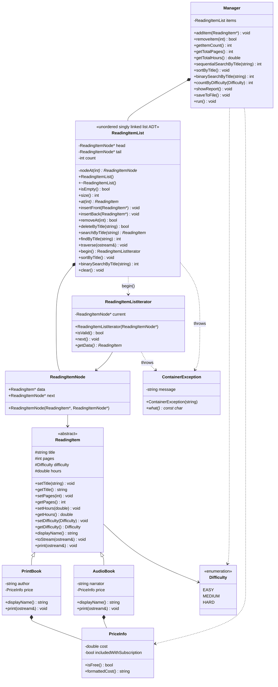

# Class Diagram

```mermaid
classDiagram
    class Difficulty {
        <<enumeration>>
        EASY
        MEDIUM
        HARD
    }

    class ContainerException {
        -string message
        +ContainerException(string)
        +what() const char*
    }

    class ReadingItem {
        <<abstract>>
        #string title
        #int pages
        #Difficulty difficulty
        #double hours
        +setTitle(string) void
        +getTitle() string
        +setPages(int) void
        +getPages() int
        +setHours(double) void
        +getHours() double
        +setDifficulty(Difficulty) void
        +getDifficulty() Difficulty
        +displayName() string
        +toStream(ostream&) void
        +print(ostream&) void
    }

    class PriceInfo {
        -double cost
        -bool includedWithSubscription
        +isFree() bool
        +formattedCost() string
    }

    class PrintBook {
        -string author
        -PriceInfo price
        +displayName() string
        +print(ostream&) void
    }

    class AudioBook {
        -string narrator
        -PriceInfo price
        +displayName() string
        +print(ostream&) void
    }

    class ReadingItemNode {
        +ReadingItem* data
        +ReadingItemNode* next
        +ReadingItemNode(ReadingItem*, ReadingItemNode*)
    }

    class ReadingItemListIterator {
        -ReadingItemNode* current
        +ReadingItemListIterator(ReadingItemNode*)
        +isValid() bool
        +next() void
        +getData() ReadingItem*
    }

    class ReadingItemList {
        <<unordered singly linked list ADT>>
        -ReadingItemNode* head
        -ReadingItemNode* tail
        -int count
        -nodeAt(int) ReadingItemNode*
        +ReadingItemList()
        +~ReadingItemList()
        +isEmpty() bool
        +size() int
        +at(int) ReadingItem*
        +insertFront(ReadingItem*) void
        +insertBack(ReadingItem*) void
        +removeAt(int) bool
        +deleteByTitle(string) bool
        +searchByTitle(string) ReadingItem*
        +findByTitle(string) int
        +traverse(ostream&) void
        +begin() ReadingItemListIterator
        +sortByTitle() void
        +binarySearchByTitle(string) int
        +clear() void
    }

    class Manager {
        -ReadingItemList items
        +addItem(ReadingItem*) void
        +removeItem(int) bool
        +getItemCount() int
        +getTotalPages() int
        +getTotalHours() double
        +sequentialSearchByTitle(string) int
        +sortByTitle() void
        +binarySearchByTitle(string) int
        +countByDifficulty(Difficulty) int
        +showReport() void
        +saveToFile() void
        +run() void
    }

    ReadingItem <|-- PrintBook
    ReadingItem <|-- AudioBook
    ReadingItem --> Difficulty
    PrintBook *-- PriceInfo
    AudioBook *-- PriceInfo
    Manager *-- ReadingItemList
    ReadingItemList *-- ReadingItemNode
    ReadingItemNode --> ReadingItem
    ReadingItemListIterator --> ReadingItemNode
    ReadingItemList ..> ReadingItemListIterator : begin()
    ReadingItemList ..> ContainerException : throws
    ReadingItemListIterator ..> ContainerException : throws
    Manager ..> Difficulty
    Manager ..> PriceInfo
```
